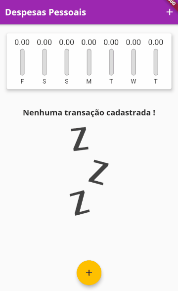

# Aplicativo Despesas Pessoais

<h1 align="center">
    </img>
</h1>

# Indice

- [Sobre](#-sobre)
- [Tecnologias Utilizadas](#-tecnologias-utilizadas)
- [Como baixar o projeto](#-como-baixar-o-projeto)
- [Icones](#-icones)

## 📜 Sobre

O aplicativo "Despesas Pessoais" é uma aplicação desenvolvida em ***Flutter*** que realiza o controle financeiro do seu usuario.<br>
Através de barras verticais auto-explicativas ele demonstra quantos "%" (0 ~ 100%) aquelas despesas cadastrastradas impactaram no dia da semana da pessoa. <br>Para isso basta cadastrar todas as suas despesas e pronto, você vai ter toda a sua semana controlada da melhor maneira na palma da sua mão.

----

## 🚀 Tecnologias Utilizadas

- [Dart](https://dart.dev/)
- [Flutter](https://flutter.dev/)

---

## 📦 Como baixar o projeto

```bash

#Clonar o repositório
$git clone https://github.com/harlleybastos/despesas-pessoais.git

#Entrar no diretório
$cd despesas-pessoais

#Instalar as dependencias
$yarn install

#Iniciar o projeto
$yarn start

```
---
## 🏷 Icones
- :package: Nova funcionalidade
- :up: Atualização
- :beetle: Correção de bug
- :checkered_flag: Release
